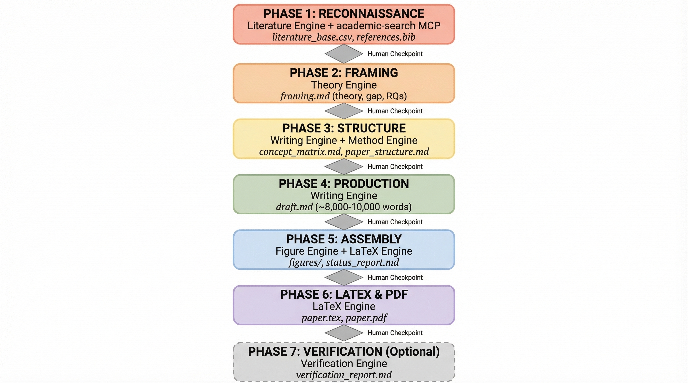

# Open Academic Paper Machine

> A Claude Code plugin that autonomously writes academic papers — from literature search to production-ready LaTeX/PDF.

[](LICENSE)
[]()
[](https://github.com/kourgeorge/arxiv-style)

> **Scope note.** This project is a *technical* contribution: it explores what is *possible* with current LLM technology for academic paper production, not what is desirable or ethically permissible. The ethical, epistemological, and policy questions raised by AI-generated academic writing — authorship attribution, academic integrity, epistemic status, potential misuse — are important but outside the scope of this tool. They are addressed in the companion position paper ([Blask & Funk, 2026](https://papers.ssrn.com/sol3/papers.cfm?abstract_id=6358578)).

## Quick Start

```bash
# 1. Install the plugin
/plugin marketplace add TobiasBlask/open-paper-machine
/plugin install open-academic-paper-machine@open-paper-machine

# 2. Install dependencies
pip install paperbanana[google] academic-search-mcp

# 3. Set up your API key (free — https://aistudio.google.com/apikey)
echo 'GOOGLE_API_KEY="your-key"' > ~/.paperbanana.env
# Or per-project: echo 'GOOGLE_API_KEY="your-key"' > .env

# 4. Go
/write-paper The impact of generative AI on organizational decision-making
```

That's it. The plugin ships the `academic-search` MCP server, the PaperBanana direct Python API for figure generation, all 16 skill engines, 4 agents, 24 curated scientific skills, 20 slash commands, and the autonomous pipeline agent. Everything starts automatically.

**Technical paper:** [The Open Academic Paper Machine: An Autonomous LLM Plugin for End-to-End Academic Paper Production](paper/paper.pdf) (Blask, 2026) — describes the system architecture, design principles, and evaluation. LaTeX source in [`paper/`](paper/).

**Position paper:** [From Creator to Orchestrator? How an LLM Agent Wrote This Paper and What That Means for Science](https://papers.ssrn.com/sol3/papers.cfm?abstract_id=6358578) (Blask & Funk, 2026) — a position paper on AI-augmented knowledge production, orchestrated through human-AI interaction using this system. [GitHub repo](https://github.com/TobiasBlask/From_Creator_to_Orchestrator).

---

## How It Works

<p align="center">
  
</p>

The machine runs autonomously through **9 phases**:

| Phase | What Happens | Your Job |
|-------|-------------|----------|
| **0. Idea Evaluation** *(v6.3.0)* | Stress-test idea along 7 dimensions, conclusion-first test, PURSUE/REFINE/KILL verdict | Decide whether to proceed |
| **1. Reconnaissance** | 4-6 search queries across 4 academic APIs, snowballing, deduplication | Check scope, redirect if needed |
| **2. Framing** | Theory selection, gap formulation, research questions, contribution statement | Confirm direction |
| **3. Structure** | Concept matrix, paper structure, word budget | Approve structure |
| **4. Production** | Write every section as complete paragraphs + generate figures | Read along, adjust |
| **5. Assembly** | Compile all sections, quality self-assessment, status report | Start review |
| **6. LaTeX & PDF** | Convert to arxiv-style LaTeX, resolve citations, compile PDF | Download and submit |
| **7. Verification** *(opt.)* | Fetch source abstracts/PDFs, verify each citation claim | Review flagged mismatches |
| **8. Revision** *(repeatable)* | Extract reviewer/co-author feedback, classify, implement changes, recompile + latexdiff | Approve change plan |

**Core principle:** Before producing, evaluate. The machine gates the pipeline — not every topic deserves months of work. Then it makes decisions and presents results. You steer at checkpoints.

Phase 8 closes the loop: send an annotated PDF from your co-author or paste reviewer comments, and the review-engine extracts, classifies, and implements all changes — then recompiles and generates a visual diff. The cycle repeats (Round 1 → 2 → 3 → ...) until acceptance.

---

## Requirements

| Requirement | Version | Notes |
|---|---|---|
| [Claude Code](https://docs.anthropic.com/en/docs/claude-code) | Latest | CLI or IDE extension (VS Code / JetBrains) |
| Python | 3.10+ | For PaperBanana and academic-search MCP servers |
| LaTeX | Any recent | Optional — only needed for PDF compilation (`/export-latex`) |
| Google API key | Free | For AI figure generation — [get one here](https://aistudio.google.com/apikey) |

> **No Google API key?** The plugin works fully without one — you just won't get AI-generated figures. The figure-engine falls back to matplotlib/seaborn. All other features (literature search, writing, LaTeX, revision, etc.) work independently.

---

## Installation

### What Gets Installed

The plugin bundles one MCP server that starts automatically, plus PaperBanana via direct Python API:

| Component | pip package | What it does |
|---|---|---|
| `academic-search` (MCP) | [`academic-search-mcp`](https://pypi.org/project/academic-search-mcp/) | Searches Semantic Scholar, OpenAlex, CrossRef, arXiv. Snowballing, BibTeX/CSV export. |
| PaperBanana (direct API) | [`paperbanana`](https://pypi.org/project/paperbanana/) | AI figure generation via Google Gemini. Multi-agent pipeline with iterative refinement. Based on [Zhu et al. (2026)](https://arxiv.org/abs/2601.23265). |

The academic-search MCP server is configured in `plugin.json` and starts when Claude Code loads the plugin. PaperBanana is called via direct Python API (`scripts/paperbanana_direct.py`) — the MCP transport layer was removed in v6.3.0 due to persistent reliability issues (timeouts, silent failures).

> **Academic foundation:** The figure generation pipeline implements the methodology from [PaperBanana: Automating Academic Illustration for AI Scientists](https://arxiv.org/abs/2601.23265) (Zhu et al., 2026). The MCP integration uses the community implementation at [`llmsresearch/paperbanana`](https://github.com/llmsresearch/paperbanana). See also the [official research repo](https://github.com/dwzhu-pku/PaperBanana).

### Step-by-Step

**1. Add the marketplace and install the plugin:**

```bash
/plugin marketplace add TobiasBlask/open-paper-machine
/plugin install open-academic-paper-machine@open-paper-machine
```

**2. Install Python dependencies:**

```bash
pip install paperbanana[google] academic-search-mcp
```

**3. Configure your Google API key** (needed for AI figure generation):

Get a free key at [Google AI Studio](https://aistudio.google.com/apikey), then set it up (choose one):

```bash
# Option A — Global (recommended, works across all projects):
echo 'GOOGLE_API_KEY="your-api-key-here"' > ~/.paperbanana.env

# Option B — Per-project:
echo 'GOOGLE_API_KEY="your-api-key-here"' > .env
```

**Key loading priority:** Environment variable → `~/.paperbanana.env` → project `.env`. Never commit `.env` to version control. See `.env.example` for a template.

**4. Install LaTeX** (for PDF compilation):

```bash
# macOS
brew install --cask mactex-no-gui

# Ubuntu/Debian
sudo apt-get install texlive-full
```

**5. Start writing:**

```bash
/write-paper Your Paper Title Here
```

### Cowork Setup

1. Download the latest release ZIP from [GitHub Releases](https://github.com/TobiasBlask/open-paper-machine/releases)
2. In Cowork, open the Plugins panel and click "+" → upload the ZIP
3. Set `GOOGLE_API_KEY` in plugin settings (optional — only needed for AI figures)
4. `/write-paper Your Paper Title`

---

## Idea Evaluation — Phase 0 (v6.3.0)

Most AI writing tools help you *write* papers. Phase 0 helps you decide *which* papers to write.

The previous pipeline took any topic and produced. Version 6.3.0 adds the missing gate: **Is this paper the right use of my time?** Based on Nicholas Carlini's research philosophy ([How to Win a Best Paper Award](https://nicholas.carlini.com/writing/2026/how-to-win-a-best-paper-award.html)) and the [research-companion](https://github.com/andrehuang/research-companion) plugin by Andre Huang.

```bash
# Standalone idea evaluation
/evaluate-idea Can LLMs replace systematic literature reviews?

# Or just run /write-paper — Phase 0 runs automatically first
/write-paper The impact of generative AI on organizational decision-making
```

### How It Works

Three specialist agents evaluate your idea before the pipeline commits to production:

| Agent | Role | Output |
|-------|------|--------|
| **Idea Critic** | Adversarial stress-test along 7 dimensions | PURSUE / REFINE / KILL verdict |
| **Research Strategist** | Strategic viability: competition, timing, comparative advantage | Green / Yellow / Red flags |
| **Brainstormer** | Cross-field connections, assumption challenges, reframings | Alternative angles and extensions |

### The 7 Evaluation Dimensions

| Dimension | Key Question | Signal |
|-----------|-------------|--------|
| **Novelty** (RS1) | If you don't do this, how long until someone else does? | Weeks / Months / Years |
| **Impact** (RS2) | Can you write a compelling conclusion right now? | Low / Medium / High |
| **Timing** (RS8) | Is the field ready? Too early? Already crowded? | Too Early / Well-Timed / Too Late |
| **Feasibility** (RS4) | What's the riskiest assumption? Can you test it in a week? | High / Medium / Low Risk |
| **Competition** (RS7) | Who else is working on this? What's your advantage? | Crowded / Moderate / Open |
| **Nugget** (RS3) | Can you state the key insight in one sentence? | Clear / Fuzzy / Missing |
| **Narrative** | Can you tell a story that makes a skeptical reader care? | Compelling / Workable / Weak |

### The Conclusion-First Test

The decisive gate. Before investing, the engine writes the best-case conclusion: if everything works perfectly, what can this paper say? If the answer is hollow or generic — if it only says "our method achieves X% improvement" — the idea doesn't have enough impact. Kill it and move on.

### Research Strategy Principles (RS1-RS8)

Eight principles guide evaluation (see `principles/research-strategy.md`):

- **RS1 (Novelty Test):** Favor problems where your unique skills create a months-to-years gap.
- **RS2 (Conclusion-First Test):** Write the conclusion before doing the research.
- **RS3 (Nugget Test):** One sentence. One idea. Every figure connects to it.
- **RS4 (Fail Fast):** Start with what's most likely to kill the project.
- **RS5 (Kill Early):** A working project with low impact is worse than a killed project.
- **RS6 (Unreasonable Effort):** Go to unreasonable lengths — but only AFTER RS4 and RS5.
- **RS7 (Comparative Advantage):** Research space is high-dimensional; find your unique corner.
- **RS8 (Timing Awareness):** Impact = skill x domain importance at this moment.

Evaluations persist to `research-evaluations/*.md` for cross-session continuity. Previously killed ideas are checked for changed conditions rather than re-evaluated from scratch.

---

## Commands

### Idea Evaluation (v6.3.0)

| Command | Description |
|---------|-------------|
| `/evaluate-idea [topic]` | **Full idea stress-test** — 7 dimensions, 3 agents, conclusion-first test, PURSUE/PARK/KILL verdict |
| `/brainstorm [topic]` | **Creative brainstorming** — cross-field connections, assumption challenges, alternative framings, wild cards |
| `/triage-project` | **Project triage** — should you continue, pivot, or kill? 5-signal assessment |
| `/scooping-check [topic]` | **Scooping risk** — who else is working on this? Watch list with researchers, venues, search terms |

### Core Pipeline

| Command | Description |
|---------|-------------|
| `/write-paper [title]` | **Full pipeline** — Phase 0 (evaluation) + Phases 1-8, start to finish |
| `/search-papers [topic]` | Phase 1: systematic literature search across 4 APIs |
| `/draft-section [section]` | Phase 4: write one specific section as complete paragraphs |
| `/export-latex` | Phase 6: convert finished draft to arxiv-style LaTeX + compiled PDF |
| `/verify-citations` | Phase 7: **verify all citations** against actual source content |
| `/respond-reviewers [pdf or comments]` | Phase 8: **full revision loop** — extract feedback, classify, implement, recompile, latexdiff |
| `/generate-figure [description]` | AI-generated academic diagram from text |
| `/generate-plot [datafile] [intent]` | Statistical plot from CSV/JSON data |

### Qualitative Data Analysis (v6.2.0)

| Command | Description |
|---------|-------------|
| `/analyze-interviews [topic]` | **Qualitative analysis pipeline** — structured summaries, thematic coding, cross-case analysis, evidence tables. Context-window-safe: summary-first, never loads all transcripts at once. Supports Gioia, Mayring, Braun & Clarke. |

### Extended Capabilities (v6.0.0)

| Command | Description |
|---------|-------------|
| `/review-paper [venue]` | **Simulated peer review** — 2 independent reviewer reports calibrated to top IS/CS venues |
| `/screen-papers [criteria]` | PRISMA-compliant SLR screening with quality assessment and flow diagram |
| `/analyze-positioning` | Differentiation matrix against closest related work + positioning statement |
| `/analyze-writing [section]` | Writing style analysis — passive voice, hedging, readability, 8 quality metrics |
| `/prepare-submission [venue]` | Venue-specific submission package: anonymization, cover letter, reviewer suggestions |
| `/monitor-literature` | Re-run search queries, find papers published since last search |
| `/generate-slides [format]` | Conference presentation slides with speaker notes (Marp-compatible) |

---

## Architecture

<p align="center">
  
</p>

### Skill Engines

The plugin contains 16 specialized skill engines (~6,500 lines of domain knowledge) that the paper-machine agent orchestrates, plus 24 curated scientific skills that auto-activate by context:

#### Idea Evaluation Engine (v6.3.0)

| Engine | Responsibility | Key Capabilities |
|--------|---------------|-----------------|
| **idea-engine** | Research idea evaluation | 7-dimension scoring, conclusion-first test, RS1-RS8 principles, PURSUE/REFINE/KILL verdicts, cross-session persistence |

#### Core Pipeline Engines

| Engine | Responsibility | Key Capabilities |
|--------|---------------|-----------------|
| **literature-engine** | Systematic literature discovery | 4 academic APIs, snowballing, PRISMA screening, concept matrix, monitoring |
| **theory-engine** | Theoretical framing | Theory matching, gap formulation, hypothesis/design principle derivation |
| **method-engine** | Research design | 13 method templates (SLR, DSR, case study, Gioia, Mayring, grounded theory, PLS-SEM, mixed, experiment/RCT, action research, ethnography, Delphi, simulation) + research data management |
| **writing-engine** | Paragraph-level text production | Section templates, sentence formulas, academic register for IS/WI/BWL, style analysis (8 metrics) |
| **qualitative-engine** | Qualitative data analysis | Summary-first transcript processing, thematic coding (Gioia/Mayring/Braun & Clarke), cross-case analysis, evidence tables |
| **figure-engine** | Visual production | PaperBanana AI diagrams (Gemini) via direct Python API, matplotlib/seaborn fallback |
| **latex-engine** | Document compilation | arxiv-style conversion, `\citep`/`\citet` citation resolution, PDF build |
| **verification-engine** | Citation verification | Source retrieval (abstract + full-text), claim-source comparison, verification report |
| **review-engine** | Revision automation | PDF annotation extraction, comment classification, change planning, latexdiff generation |

#### Extended-Capability Engines (v6.0.0)

| Engine | Responsibility | Key Capabilities |
|--------|---------------|-----------------|
| **screening-engine** | SLR paper screening | PRISMA-compliant title/abstract + full-text screening, quality assessment, flow diagram |
| **peer-review-engine** | Simulated peer review | 2 independent reviewer reports (Methodologist + Theorist), venue-calibrated, feeds into review-engine |
| **positioning-engine** | Competitive positioning | Differentiation matrix, unique positioning analysis, draft positioning paragraph |
| **submission-engine** | Submission preparation | Anonymization checks, cover letter generation, reviewer suggestions, venue formatting validation |
| **presentation-engine** | Slide generation | Conference slides with speaker notes from paper, Marp-compatible output |
| **coauthor-engine** | Author management | CRediT contribution tracking, human-AI division of labor documentation |

### MCP Servers (Bundled)

<p align="center">
  
</p>

The `academic-search` MCP server is declared in `plugin.json` and starts automatically. PaperBanana is called via direct Python API (not MCP):

| Component | Package | APIs | Purpose |
|-----------|---------|------|---------|
| `academic-search` (MCP) | `academic-search-mcp` | Semantic Scholar, OpenAlex, CrossRef, arXiv | Literature search, snowballing, multi-query, BibTeX/CSV export |
| PaperBanana (direct API) | `paperbanana[google]` | Google Gemini | AI diagram generation, statistical plots, diagram evaluation |

### Pipeline Agent

The plugin includes 4 agents:

| Agent | File | Purpose |
|-------|------|---------|
| **paper-machine** | `agents/paper-machine.md` | Autonomous pipeline orchestrator — gates at Phase 0, then orchestrates all 16 skill engines through Phases 1-8 |
| **idea-critic** | `agents/idea-critic.md` | Adversarial idea stress-test — 7 evaluation dimensions, PURSUE/REFINE/KILL verdicts |
| **research-strategist** | `agents/research-strategist.md` | Strategic advisor — 5 modes: project triage, comparative advantage, impact forecasting, opportunity cost, scooping risk |
| **brainstormer** | `agents/brainstormer.md` | Creative idea generator — cross-field connections, assumption challenges, alternative framings |

The paper-machine agent orchestrates all 16 skill engines through the pipeline phases. Since v6.3.0, it evaluates ideas (Phase 0) before committing to production, using the three specialist agents. Operating principles:

1. **Evaluate before producing.** Phase 0 gates the pipeline (v6.3.0).
2. **DO, don't ask.** Make decisions and present results.
3. **Produce text, not plans.** Every phase yields deliverable output.
4. **Checkpoint, don't block.** Present work, then continue.
5. **Be explicit about decisions.** State what was chosen and why.
6. **Save everything to files.** Every phase produces artifacts.

### Scientific Skills Library (v6.1.0)

Version 6.1.0 integrates **24 curated scientific skills** from [K-Dense AI's claude-scientific-skills](https://github.com/K-Dense-AI/claude-scientific-skills) (MIT License). These skills auto-activate based on context and complement the 15 core engines with domain-specific expertise:

| Category | Skills | Complements |
|----------|--------|-------------|
| **Research Ideation** | `hypothesis-generation`, `scientific-brainstorming`, `scientific-critical-thinking`, `consciousness-council`, `what-if-oracle` | theory-engine |
| **Writing** | `scientific-writing`, `citation-management`, `markdown-mermaid-writing` | writing-engine |
| **Literature & Review** | `literature-review`, `peer-review`, `scholar-evaluation` | literature/review-engine |
| **Statistics** | `statistical-analysis`, `exploratory-data-analysis`, `statsmodels` | method-engine |
| **Visualization** | `matplotlib`, `seaborn`, `plotly`, `scientific-visualization`, `scientific-schematics` | figure-engine |
| **Submission** | `venue-templates`, `research-grants` | submission/latex-engine |
| **Reference Management** | `pyzotero` | verification-engine |
| **Utility** | `get-available-resources`, `networkx` | general |

Skills are stored in `scientific-skills/` and follow the [Agent Skills](https://agentskills.io/) standard. Each skill is a `SKILL.md` file with YAML frontmatter and structured domain knowledge. Claude Code discovers and loads them automatically when relevant to the current task.

### Markdown-to-LaTeX Converter

`scripts/md_to_latex.py` (732 lines) converts the draft into production-ready LaTeX:

- `(Author, Year)` citations to `\citep{key}` / `\citet{key}` with BibTeX key matching
- Markdown tables to `booktabs` LaTeX tables
- Markdown images to LaTeX figure environments
- Section hierarchy mapping (`#` to `\section`, `##` to `\subsection`, etc.)
- Abstract and keyword extraction
- `[CITE]`, `[DATA]`, `[TODO]` markers to LaTeX comments

```bash
# Standalone usage
python scripts/md_to_latex.py draft.md references.bib --output paper.tex --compile
```

---

## Output Files

After `/write-paper` + `/export-latex`, your project directory contains:

| File | Description |
|------|-------------|
| `draft.md` | Complete paper draft with all sections |
| `references.bib` | BibTeX entries for all cited papers |
| `literature_base.csv` | Full literature database from search phase |
| `concept_matrix.md` | Webster & Watson concept matrix |
| `framing.md` | Theoretical framing (gap, RQs, contribution) |
| `paper_structure.md` | Paper structure with word budget |
| `figures/` | Generated diagrams and plots (PNG, 300 DPI) |
| `status_report.md` | Completion status and open items |
| `latex/paper.tex` | arxiv-style LaTeX source |
| `latex/paper.pdf` | Compiled PDF, ready for submission |
| `verification_report.md` | Citation verification results *(after `/verify-citations`)* |
| `latex/paper_diff.pdf` | Visual change tracking via latexdiff *(after `/respond-reviewers`)* |
| `orchestration_log.md` | Audit trail: timestamps, actors, decisions, quality gate outcomes *(v5.2.0+)* |
| `outputs/revision_log_rN.md` | Detailed change log per revision round *(after `/respond-reviewers`)* |
| `interviews/summaries/` | Structured interview summaries *(after `/analyze-interviews`)* |
| `outputs/codebook_v1.md` | First-order codes with definitions and examples *(after `/analyze-interviews`)* |
| `outputs/theme_map.md` | Second-order themes grouped from codes *(after `/analyze-interviews`)* |
| `outputs/cross_case_analysis.md` | Cross-interview comparison matrix *(after `/analyze-interviews`)* |
| `outputs/evidence_table.md` | Verbatim quotes organized by theme *(after `/analyze-interviews`)* |

---

## Repository Structure

```
.
├── .claude-plugin/
│   ├── plugin.json             # Plugin manifest + MCP server config
│   └── marketplace.json        # Marketplace definition for install
├── agents/                      # 4 agents (v6.3.0)
│   ├── paper-machine.md        # Autonomous pipeline agent (Phase 0-8)
│   ├── idea-critic.md          # Adversarial idea stress-test (7 dimensions)
│   ├── research-strategist.md  # Strategic research advisor (5 modes)
│   └── brainstormer.md         # Creative idea generator (cross-field)
├── commands/                    # 20 slash commands
│   ├── evaluate-idea.md        # /evaluate-idea → full idea stress-test (v6.3.0)
│   ├── brainstorm.md           # /brainstorm → creative idea generation (v6.3.0)
│   ├── triage-project.md       # /triage-project → continue/pivot/kill (v6.3.0)
│   ├── scooping-check.md       # /scooping-check → competition assessment (v6.3.0)
│   ├── write-paper.md          # /write-paper  → full pipeline
│   ├── search-papers.md        # /search-papers → Phase 1
│   ├── screen-papers.md        # /screen-papers → SLR screening
│   ├── draft-section.md        # /draft-section → Phase 4
│   ├── export-latex.md         # /export-latex  → Phase 6
│   ├── verify-citations.md     # /verify-citations → Phase 7
│   ├── respond-reviewers.md    # /respond-reviewers → Phase 8
│   ├── review-paper.md         # /review-paper → simulated peer review
│   ├── analyze-interviews.md   # /analyze-interviews → qualitative analysis (v6.2.0)
│   ├── analyze-positioning.md  # /analyze-positioning
│   ├── analyze-writing.md      # /analyze-writing → style analysis
│   ├── monitor-literature.md   # /monitor-literature
│   ├── prepare-submission.md   # /prepare-submission
│   ├── generate-figure.md      # /generate-figure
│   ├── generate-plot.md        # /generate-plot
│   └── generate-slides.md      # /generate-slides
├── principles/                  # Research strategy reference (v6.3.0)
│   └── research-strategy.md    # RS1-RS8 principles (Carlini + research-companion)
├── skills/                      # 16 domain-specific engines (~6,500 lines)
│   ├── idea-engine/            # Idea evaluation + Phase 0 orchestration (v6.3.0)
│   ├── literature-engine/      # Systematic literature search + monitoring
│   ├── theory-engine/          # Theoretical framing
│   ├── method-engine/          # 13 research method templates + RDM
│   ├── writing-engine/         # Academic writing templates + style analysis
│   ├── qualitative-engine/    # Qualitative data analysis (v6.2.0)
│   ├── figure-engine/          # Figure generation (PaperBanana)
│   ├── latex-engine/           # LaTeX conversion + compilation
│   ├── verification-engine/    # Citation verification against sources
│   ├── review-engine/          # Revision automation (PDF → implement → latexdiff)
│   ├── screening-engine/       # PRISMA-compliant SLR screening
│   ├── peer-review-engine/     # Simulated double-blind peer review
│   ├── positioning-engine/     # Competitive positioning analysis
│   ├── submission-engine/      # Venue-specific submission preparation
│   ├── presentation-engine/    # Conference slide generation
│   └── coauthor-engine/        # CRediT author contribution tracking
├── scientific-skills/              # 24 curated skills from K-Dense AI (v6.1.0)
│   ├── hypothesis-generation/     # Structured hypothesis formulation
│   ├── scientific-writing/        # IMRAD, reporting guidelines, APA/AMA
│   ├── statistical-analysis/      # Test selection, APA reporting
│   ├── matplotlib/                # Publication-quality plots
│   ├── venue-templates/           # LaTeX templates for 30+ venues
│   ├── consciousness-council/     # Multi-perspective deliberation
│   └── ... (24 skills total)
├── scripts/
│   ├── md_to_latex.py          # Markdown-to-LaTeX converter (732 lines)
│   ├── extract_annotations.py  # PDF annotation extraction (PyMuPDF)
│   ├── process_interviews.py   # Interview transcript processing (v6.2.0)
│   └── paperbanana_direct.py   # Direct PaperBanana API (bypasses MCP transport)
├── templates/
│   └── arxiv.sty               # arxiv-style LaTeX template
├── paper/                       # Technical paper (Blask, 2026)
│   ├── paper.tex               # LaTeX source
│   ├── paper.pdf               # Compiled PDF
│   ├── references.bib          # Bibliography
│   └── figures/                # PaperBanana-generated diagrams
├── .env.example                # API key template
├── .gitignore
├── LICENSE
└── README.md
```

---

## Figure Generation

PaperBanana implements the multi-agent pipeline from [Zhu et al. (2026)](https://arxiv.org/abs/2601.23265), powered by Google Gemini:

```
Retriever → Planner → Stylist → Visualizer → Critic (×3 iterations) → Final PNG
```

The 5-agent, 2-phase architecture uses in-context learning with curated reference examples (Phase 1: planning) and iterative VLM-as-Judge refinement (Phase 2: generation).

### Direct Python API (v6.2.0)

Since v6.2.0, the figure-engine calls PaperBanana's Python API directly via `asyncio.run()`. Since v6.3.0, the MCP transport has been removed entirely — it was unreliable (timeouts, silent failures in long-running generation pipelines of ~35-45 seconds per figure).

**Reliability chain:** Direct Python API → matplotlib/seaborn (fallback).

The wrapper script `scripts/paperbanana_direct.py` supports all PaperBanana features:

```bash
# Generate a methodology diagram
python3 scripts/paperbanana_direct.py diagram \
  --source-context "Our method uses a transformer encoder..." \
  --caption "Figure 1: System Architecture" \
  --output-dir figures/ \
  --filename "fig_architecture.png" \
  --iterations 3 \
  --aspect-ratio 16:9

# Generate a statistical plot
python3 scripts/paperbanana_direct.py plot \
  --data '{"model": ["GPT-4", "Claude", "Gemini"], "accuracy": [0.89, 0.92, 0.87]}' \
  --caption "Model comparison on benchmark" \
  --output-dir figures/

# Download expanded reference set (294 examples, ~257 MB, one-time)
python3 scripts/paperbanana_direct.py download-references
```

**API key loading priority:** `GOOGLE_API_KEY` environment variable → `~/.paperbanana.env` → project `.env`.

| Environment | Engine | Quality |
|---|---|---|
| Claude Code | PaperBanana + Gemini (direct API) | AI-generated, publication-quality |
| Cowork | matplotlib / seaborn | Clean statistical plots |

If PaperBanana is unavailable (no API key, network issues), the figure-engine falls back to Python-based generation using matplotlib and seaborn with academic styling presets.

> **References:** [Official research repo](https://github.com/dwzhu-pku/PaperBanana) · [Community MCP implementation](https://github.com/llmsresearch/paperbanana) · [arXiv:2601.23265](https://arxiv.org/abs/2601.23265)

---

## Citation Verification

The verification-engine checks whether cited papers actually support the claims attributed to them:

```bash
/verify-citations
```

**How it works:**
1. Extracts all `\citep{}`/`\citet{}` citations from `paper.tex` (or `(Author, Year)` from `draft.md`) with surrounding context
2. Matches to BibTeX entries and DOIs in `references.bib`
3. Fetches source material via academic-search MCP:
   - **Tier A:** Abstracts + TLDRs from Semantic Scholar, OpenAlex, CrossRef (always)
   - **Tier B:** Full-text PDFs for open-access papers — arXiv, DOAJ, etc. (when available)
4. Compares each attributed claim against actual source content
5. Classifies as: VERIFIED, PLAUSIBLE, MISMATCH, UNVERIFIABLE, or NOT FOUND
6. Generates `verification_report.md` with priority issues and fix recommendations

**Prioritized processing:** Load-bearing citations (gap statement, key statistics) are verified first, then methodology/theory citations, then background references. Results after each tier so you can act on critical mismatches immediately.

---

## Revision Automation (Phase 8)

The review-engine automates the co-author/reviewer revision loop — derived from 4 actual revision rounds on the paper that built this tool:

```bash
/respond-reviewers @annotated_review.pdf
```

**How it works:**

```
📄 Annotated PDF ──→ EXTRACT ──→ MAP ──→ CLASSIFY ──→ PLAN (Quality Gate)
                                                            │
                                              IMPLEMENT ──→ VERIFY ──→ DOCUMENT
                                                                         │
                     New Round ◄─────────────────────────────────────────┘
```

1. **EXTRACT** — Parses PDF annotations (highlights, sticky notes, strikeouts) via PyMuPDF, or parses pasted reviewer comments
2. **MAP** — Locates each comment's corresponding position in `paper.tex` (line number, section, context)
3. **CLASSIFY** — Determines action type (DELETE, REPLACE, MOVE, RESTRUCTURE, FIX, FIGURE, SHORTEN, APPROVE, QUESTION) and priority
4. **PLAN** — Presents a structured change plan table for your approval (**quality gate** — nothing executes without your OK)
5. **IMPLEMENT** — Executes changes in dependency order, invoking figure-engine or writing-engine as needed
6. **VERIFY** — Recompiles LaTeX (0 errors target), generates `latexdiff` for visual change tracking
7. **DOCUMENT** — Creates change log, optional R&R letter, updates orchestration log, commits

**Supports:** Co-author annotated PDFs, journal R&R decision letters, self-review output. Handles multilingual comments (German/English). Repeats for Round 1 → 2 → 3 → ... until acceptance.

---

## Supported Research Methods

The method-engine (797 lines) provides complete section templates for 13 methodologies:

- **Systematic Literature Review (SLR)** — PRISMA flow, inclusion/exclusion criteria
- **Case Study** — Yin methodology, cross-case analysis
- **Gioia Method** — 1st/2nd order coding, aggregate dimensions
- **Mayring Content Analysis** — Category system, coding rules
- **Grounded Theory** — Open/axial/selective coding
- **PLS-SEM** — Measurement model, structural model
- **Design Science Research (DSR)** — Hevner framework, evaluation cycles
- **Mixed Methods** — Sequential/concurrent designs
- **Experiment / RCT** — Experimental design, control groups, randomization
- **Action Research** — Iterative cycles, practitioner-researcher collaboration
- **Ethnography** — Fieldwork, participant observation, thick description
- **Delphi Study** — Expert panel, multi-round consensus building
- **Simulation** — Agent-based modeling, discrete event simulation

Plus **Research Data Management** guidance: FAIR principles, data management plans (DMP), data availability statements.

---

## Troubleshooting

| Problem | Solution |
|---------|----------|
| `paperbanana: command not found` | Run `pip install paperbanana[mcp,google]` |
| `academic-search-mcp: command not found` | Run `pip install academic-search-mcp` |
| `GOOGLE_API_KEY not set` | Create `~/.paperbanana.env` with your key (see [Installation](#step-by-step)) |
| `API key expired / 400 error` | Get a new key at [Google AI Studio](https://aistudio.google.com/apikey) and update `~/.paperbanana.env` |
| PaperBanana figure generation times out | Ensure you're on v6.3.0+ — the unreliable MCP transport has been removed. Figures are now generated via direct Python API only |
| `/write-paper` not recognized | Plugin not loaded. Run `/plugin install open-academic-paper-machine@open-paper-machine` |
| LaTeX compilation fails | Install LaTeX: `brew install --cask mactex-no-gui` (macOS) or `apt install texlive-full` (Linux) |
| `No module named 'paperbanana'` | Ensure you installed with extras: `pip install paperbanana[mcp,google]` (not just `pip install paperbanana`) |

---

## AI Usage Disclaimer

Many journals and conferences now require disclosure of AI tool usage in research ([ACM Policy](https://www.acm.org/publications/policies/new-acm-policy-on-authorship), [Springer Nature Policy](https://www.nature.com/nature-portfolio/editorial-policies/ai), [Elsevier Policy](https://www.elsevier.com/about/policies-and-standards/the-use-of-generative-ai-and-ai-assisted-technologies-in-writing)). Below is a **template disclaimer** you can adapt for papers produced with or assisted by this tool.

### Short Version (permissive venues)

> **Use of AI tools.** The authors used the *Open Academic Paper Machine* (Blask, 2026) for [literature search / text drafting / figure generation / LaTeX conversion / citation verification]. All output was reviewed and revised by the authors, who take full responsibility for the final content.

### Full Version (strict venues: ACM, Nature, Elsevier)

> **Use of AI-assisted tools.** This paper was produced with the assistance of the *Open Academic Paper Machine* (Blask, 2026), a Claude Code plugin that automates academic paper production workflows. Specifically, AI was used for: [**select applicable**] (1) systematic literature search and deduplication across academic databases; (2) drafting initial text for [specific sections, e.g., "the Related Work section"]; (3) generation of publication-quality figures using PaperBanana (Zhu et al., 2026); (4) conversion to LaTeX and bibliography management; (5) citation verification against source abstracts. All AI-generated content was reviewed, validated, and revised by the author(s). The author(s) take full responsibility for the final content, including the accuracy of all claims, citations, and conclusions. The tool and its documentation are openly available at https://github.com/TobiasBlask/open-paper-machine.

### Guidance

- **Be specific.** Don't just write "AI was used." State *which tasks* were AI-assisted and *which parts* you wrote or verified yourself.
- **Claim responsibility.** Journals want to know a human checked the output. Make that explicit.
- **Cite the tools.** Reference both the Paper Machine and PaperBanana if you used AI figures (see [Citation](#citation) below).
- **Check venue policy.** Requirements vary — some venues require the disclaimer in a footnote, others in an acknowledgments section, others in a cover letter. Check your target venue's AI policy before submission.
- **Not an author.** Current consensus across major publishers: AI tools cannot be listed as co-authors. Credit them in the methods or acknowledgments instead.

---

## Citation

If you use this tool in your research, please cite the technical paper:

```bibtex
@article{blask2026opm,
  title={The Open Academic Paper Machine: An Autonomous {LLM} Plugin for
         End-to-End Academic Paper Production},
  author={Blask, Tobias-Benedikt},
  year={2026},
  note={Working paper}
}
```

The position paper (orchestrated through human-AI interaction using this system):

```bibtex
@article{blask2026creator,
  title={From Creator to Orchestrator? How an {LLM} Agent Wrote This Paper
         and What That Means for Science},
  author={Blask, Tobias-Benedikt and Funk, Burkhardt},
  journal={SSRN Electronic Journal},
  year={2026},
  note={Available at \url{https://papers.ssrn.com/sol3/papers.cfm?abstract_id=6358578}}
}
```

The idea evaluation framework (v6.3.0) is inspired by:

- Nicholas Carlini's essay [How to Win a Best Paper Award](https://nicholas.carlini.com/writing/2026/how-to-win-a-best-paper-award.html) (2026) — conclusion-first test, taste for problems, kill conditions, unreasonable effort
- Andre Huang's [research-companion](https://github.com/andrehuang/research-companion) plugin (MIT License) — 3 agents, 7 evaluation dimensions, RS1-RS8 principles

The figure generation pipeline is based on:

```bibtex
@article{zhu2026paperbanana,
  title={PaperBanana: Automating Academic Illustration for {AI} Scientists},
  author={Zhu, Dawei and Meng, Rui and Song, Yale and Wei, Xiyu and Li, Sujian
          and Pfister, Tomas and Yoon, Jinsung},
  journal={arXiv preprint arXiv:2601.23265},
  year={2026}
}
```

---

## License

MIT License. See [LICENSE](LICENSE) for details.

**Author:** Prof. Dr. Tobias-Benedikt Blask — [Harz University of Applied Sciences](https://www.hs-harz.de)
